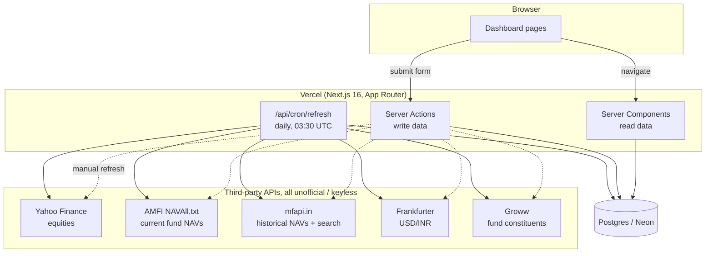
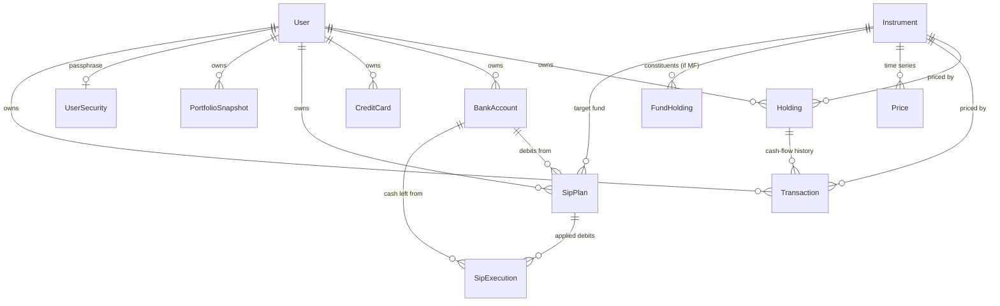

# Corpus: Architecture

_How the system fits together and why it was built this way. `PLAN.md` has the
changelog and reasoning behind each change in the order it happened; this file
has the standing picture. `TODO.md` has what's next._

## What this is

A personal finance hub for **one user**: Indian stocks, mutual funds and US
stocks, bank balances, credit cards, SIPs and a credit score, unified into a
single net-worth view, plus a Tickertape-style mutual-fund overlap/sector
analysis. It holds sensitive data, so "nobody but me" is load-bearing, not a
nice-to-have.

## System shape



One deployable, no separate API server. Server Components read; Server Actions
write; the cron route does the same writes on a schedule. Every third-party
call in the diagram is unofficial and keyless: no vendor contract exists, so
every provider is written to degrade rather than throw (see
[Graceful degradation](#graceful-degradation-everything-outside-the-database-can-fail)).

## Request flow

**Page load.** A route under `src/app/(dashboard)/*` is an `async` Server
Component. It calls `requireUnlocked()`, then queries directly through Prisma
(no client-side fetching, no API route in between) and renders. Nothing is
sent to the browser that the page didn't already have server-side.

**A write.** A form posts to a `"use server"` action in
`lib/<domain>/actions.ts`. The action re-derives the user from the session
(never trusts an id from the client), validates with Zod, writes through
Prisma, and calls `revalidatePath()` on every page that shows the changed
data. There is no separate REST or GraphQL layer: the action *is* the API,
typed end to end.

**Daily refresh.** Vercel Cron hits `/api/cron/refresh` at 03:30 UTC
(`vercel.json`), gated by `CRON_SECRET` as a bearer token. It refreshes
prices, fund constituents, applies due SIP debits, rolls SIP dates forward,
and writes each user's net-worth snapshot for the day, the same sequence the
manual "Refresh" button runs, so there's exactly one code path for it.

## Folder structure

```
src/
  app/
    (dashboard)/<page>/page.tsx   route = feature; layout.tsx gates the group
    (dashboard)/<page>/loading.tsx  instant nav fallback, one per page
    api/cron/refresh/route.ts     the one scheduled job
    api/export/report/route.ts   PDF export, streamed as an attachment
    api/auth/[...nextauth]/       Auth.js handler
    api/export/backup/route.ts   encrypted full-data export, streamed as an attachment
    apple-icon.tsx, opengraph-image.tsx, icons/[size]/route.tsx, icon.svg
                                   generated with next/og (except icon.svg, static); all draw
                                   from lib/mark.tsx, the one place the brand mark's geometry
                                   lives (icon.svg is the one file that can't import it — see
                                   Known Gotchas)
    manifest.ts, offline/page.tsx  PWA install manifest + offline fallback page
  components/
    <domain>/                     dialogs, tables: one component file per concern
    ui/                           shadcn/Base UI primitives, generic
    charts/                       recharts wrappers
    layout/loading/               skeleton-kit.tsx + loading-mark.tsx, shared by every loading.tsx
    security/                     TOTP setup + encrypted backup export dialogs
  lib/
    <domain>/
      schema.ts        Zod validation + pure helpers (date math, labels)
      queries.ts        read paths, always scoped by userId
      actions.ts        "use server" mutations
      constants.ts       types/labels safe to import from client components
      *.test.ts          co-located with the module they test
    portfolio/providers/         PriceProvider / FxProvider implementations
    http/fetch-retry.ts          the one retry-with-timeout wrapper every outbound fetch uses
    pdf/                         report-data.ts (gather) + build-report-pdf.ts (render)
    backup/                      full-account encrypted export: gather.ts (collect) + crypto.ts (encrypt)
    security/totp.ts             TOTP passphrase-recovery secret generation/verification
    mark.tsx                     the brand mark's geometry, as both data and JSX components
    db/prisma.ts                 the one PrismaClient singleton
    db/seed-portfolio.ts, backfill-cas-transactions.ts   one-off scripts, run via jiti, not the app
    transactions/record.ts       the one place every action writes a Transaction row from
    imports/cas-cams-kfintech.ts CAMS/KFintech CAS parser: pure text in, structured rows out
    crypto/encryption.ts         AES-256-GCM field encryption
  generated/prisma/              Prisma client output, gitignored
```

The `schema / queries / actions / constants` split per domain is deliberate
and consistent everywhere (`sips/`, `holdings/`, `accounts/`, `cards/`,
`credit/`, `funds/`...): `constants.ts` has no Prisma import, so it's the only
file in a domain a Client Component may import directly.

## Data model

Every money column is `Prisma.Decimal`, never `Float`: a `Decimal(20,6)` for
per-unit prices and quantities, `Decimal(20,2)` for aggregate rupee amounts.
Floats would silently drift on repeated arithmetic; this is a finance app, so
that's not an acceptable trade.



**`Instrument` is shared across users**, keyed on `(type, symbol)`. One price
fetch serves everyone, which matters once this stops being single-user. A
mutual fund's real identity is its AMFI scheme code (`externalId`), not its
symbol: the seeded funds carry hand-made symbols like `JIOBR_FLEXI` while
search offers `MF153859` for the same scheme, so instrument resolution
matches on scheme code first and falls back to `(type, symbol)`. `isin`
(2026-09-13) is a third key, needed only for resolving a CAS/broker-export
import, which identifies a fund by ISIN, never by scheme code or symbol.

**`Holding` stores `quantity` and `avgBuyPrice` directly**, but as a
*maintained cache* now, not the only record: every write path that changes
either column (manual entry, top-up, SIP auto-apply) writes a matching
`Transaction` row in the same DB transaction, so the two can never drift
apart. `Transaction` is the ledger `Holding` never had — `type`
(`BUY`/`SELL`/`DIVIDEND`), `quantity`, `pricePerUnit`, `amount`/`fees` (native
currency, matching `Holding.avgBuyPrice`), and `date` (when the money
actually moved, never `createdAt`) — which is what XIRR, CSV import, and
dividend tracking were blocked on. `source`/`folio`/`importRef` exist for
imports specifically: `importRef` makes re-running an import idempotent,
`folio` is audit display only, never a join key. See
[`lib/imports/cas-cams-kfintech.ts`](../src/lib/imports/cas-cams-kfintech.ts)
and the backfill note below for how the existing mutual-fund holdings got
their real history.

**`SipExecution`** is the audit trail and the idempotency guard for automatic
purchases in one row: unique on `(sipPlanId, dueDate)`, so a cron that runs
twice cannot buy the same units twice. `dueDate` (scheduled) and `navDate`
(NAV actually used) are stored separately because they diverge on a weekend
or public holiday; see
[Debit date vs. allotment date](#debit-date-vs-allotment-date).
`reversedAt` marks a bounced-mandate reversal without deleting the row: the
row is still both the audit trail and the cron's "last execution" cursor, so
deleting it would make the very next run re-apply the exact debit that was
just reversed. Reversal is scoped to only the most recent, not-yet-reversed
execution per plan — `Holding.quantity`/`avgBuyPrice` are running totals, not
a ledger, so undoing an older execution while newer ones sit on top of it has
no correct answer without a stored order to replay.

**`SipPlan.dayOfMonth` is overloaded by `frequency`.** For `MONTHLY` and
`QUARTERLY` it's the within-month day; for `WEEKLY` it's instead a day of
week (0 Sun – 6 Sat, matching `Date.getUTCDay()`). No separate column for
either: `QUARTERLY`'s phase (which three months of the year it lands in)
comes from the plan's own `applyFrom` instead — a plan created in March
debits March/June/September/December, one created in April debits
April/July/October/January. `nextSipDate()`/`dueDatesBetween()`
(`lib/sips/schema.ts`) take `frequency` as a parameter and branch on it;
`MONTHLY`'s own math is untouched by either of the other two.

**`PortfolioSnapshot`** is one row per user per day, unique on
`(userId, asOf)`, holding both investment totals and full net-worth totals
(assets, liabilities, net). It's what the trend chart reads; without it the
chart would only ever show "now."

## Design decisions

### Graceful degradation: everything outside the database can fail

Every price/NAV/FX/constituent provider follows the same contract
(`PriceProvider` / `FxProvider` in `lib/portfolio/providers/types.ts`):
fetch, and on failure return nothing rather than throwing. `refreshPortfolioPrices()`
counts failures per provider and **never deletes an existing cached price**,
so a dead upstream degrades the freshness of a number instead of blanking it.

This was not theoretical: the AMFI NAV URL returned 404 for months before
anyone noticed, and every mutual fund silently kept its seeded placeholder
price the whole time. The provider threw, degradation swallowed it, and
nothing surfaced the failure. That gap is closed by the next decision.

### Peer comparison over a fixed staleness window

The fix for the above isn't "alert if no price in N days": markets close for
weekends and holidays, so a fixed window either cries wolf every long weekend
or is set so loose that a genuinely dead symbol takes weeks to surface. That
is exactly what happened: five holdings sat on a six-week-old seed price with
no alert.

`findStalePrices()` (`lib/holdings/stale-prices.ts`) instead judges each
instrument **against its own peers of the same type**. If a stock's peers all
priced today and it didn't, the calendar isn't the explanation: the symbol
is wrong (`LAGGING`). If a whole type is behind the clock, peer comparison is
blind to it (everything is equally stale), so the group's freshest price is
separately checked against `now` (`SOURCE_DOWN`), the shape of the AMFI
outage. The slack is 5 days: the longest realistic run of closed market days
is a weekend wrapped around consecutive holidays (4), plus one failed cron
run. Surfaced as the first dashboard nudge, naming the symbols.

### Two search keys, on purpose

Adding a holding used to require knowing the exact ticker and, for a fund,
the AMFI scheme code, and getting either wrong meant the position priced silently as
`null` forever (the five-holding incident above). `lib/instruments/search.ts`
searches by **name** (mfapi.in for funds, Yahoo for equities) purely to
resolve those identifiers; once stored, everything downstream prices by
**symbol or scheme code**, never by name. Search only offers listings the
pricing pipeline can actually quote: Indian equities try `.NS` then `.BO`,
so a BSE-only stock is offered and priced, but a Brazilian DRN or a London
cross-listing is dropped rather than added and left permanently broken.

### Debit date vs. allotment date

A SIP due on a Saturday is allotted at Monday's NAV; the same happens on any
public holiday. Rather than maintain a holiday calendar (goes stale yearly,
still misses exchange-specific closures), `resolveAllotmentNav()`
(`lib/portfolio/providers/mfapi-nav-history.ts`) reads the shift straight off
the published NAV series: **the allotment NAV is the first NAV published on
or after the debit date.** AMFI publishes only on business days, so the
series *is* the business-day calendar, for free. When no NAV exists yet
(due today, before the evening upload) the plan is left alone and retried
rather than priced off a stale figure.

### One blended-average function, two callers

Adding units to an existing position, whether a SIP allotment or a manual
top-up, needs the same weighted-average math:
`(oldInvested + amountSpent) / newQuantity`, computed from the money actually
spent rather than from the rounded unit count (which would leak paise on
every purchase). `blendedAverage()` and `unitsForAmount()` live once in
`lib/sips/math.ts` and are called from both `lib/sips/apply.ts` and
`lib/holdings/actions.ts#topUpHolding`, so the two paths cannot silently
disagree on how a position's cost basis is computed.

### A SIP debit is a transfer, not an event in isolation

When a SIP applies, `applyOneDebit()` updates the holding **and**
decrements the linked bank balance inside the same Prisma transaction. The
same rupees leave the bank and arrive as units, so net worth is unchanged and
only its composition moves: cash and units can never disagree, because
either both writes commit or neither does. The account is optional
(`bankAccountId` on `SipPlan`), and which account paid is recorded per
`SipExecution` rather than read back off the current plan, so re-pointing a
SIP at a different bank later can't rewrite where past debits came from.

### The Transaction ledger: a cache in front, a real history underneath

`Holding.quantity`/`avgBuyPrice` stay exactly as every existing read path
(`valuation.ts`, `consolidation.ts`, every dashboard query) already expects
them — a maintained cache, not something to derive on every read. What
changed is that nothing may update either column anymore without also
writing a `Transaction` row describing the same event, in the same
`$transaction`: `createHolding` (only on genuinely creating a new position,
not on colliding with an existing one, which behaves like a correction and
gets none), `topUpHolding`, and `applyOneDebit`. A SIP reversal deletes its
matching `Transaction` (found by `importRef: "SIP_EXEC:<executionId>"`)
rather than writing a compensating row: unlike `SipExecution.reversedAt`,
`Transaction` has no idempotency-cursor job that a soft-delete would need to
preserve, so the honest ledger fact — this purchase never really settled —
is that the row is gone, not present-but-flagged for every future consumer
to remember to filter.

**Backfill: the CAS is real history for 7 mutual funds, nothing else.**
A CAMS/KFintech Consolidated Account Statement lists every real purchase
across every folio, so `lib/imports/cas-cams-kfintech.ts` parses its fixed
tabular layout (regex-based — the format is rigid enough that an LLM pass
isn't needed here, unlike a broker's own inconsistently-shaped holdings
export) into transactions and per-folio closing balances. `data/cas-raw/` is
gitignored (real PAN/address/mobile in the source PDF); the parser itself
takes plain extracted text and has no Prisma import, so it's unit-tested
against a fabricated fixture rather than the real file.

Two real parsing gotchas, both confirmed against the actual statement:
a noise line (`*** Stamp Duty ***`, `***Cancelled***`, `***Address
Updated...***`) carries the same leading date as a real purchase line, and a
registrar can legitimately post two separate purchases on the same folio,
date, description *and* amount (two SIP instalments processed together) —
distinguishing them needs the line's own trailing running-unit-balance
column, not just the four fields that usually make a row unique.

The backfill script (`lib/db/backfill-cas-transactions.ts`, one-off, run via
`jiti` since the repo has no `ts-node`/`tsx`) is idempotent: every row's
`importRef` is the CAS line itself, so re-running it is a no-op on rows
already written. It never touches `Holding` for a fund that already
reconciles against the CAS (5 of 7 did, exactly); it does for the two that
didn't — Bandhan Small Cap and JioBlackRock Flexi Cap were overstated by
8.664 and 49.622 units respectively, because their `SipPlan.amountInr` was
lowered at the broker without the app being told, so the cron kept
auto-applying the old, higher amount and buying units that were never really
purchased. The CAS was taken as ground truth on explicit direction and both
`Holding` rows were corrected down to exactly what it shows. The first
write-up here guessed the cause was a stale `SipPlan.amountInr`; checked
against the live plans afterward and that wasn't it — both were already at
the right amount. The actual mechanism behind the original drift is
unconfirmed (most likely the original manual-reconciliation baseline itself
was a little high); the corrected `Holding` figures are what matter.

Every non-mutual-fund holding (34 stock/ETF positions, no source document
for any of them in this repo) got one `OPENING_BALANCE` `Transaction`
instead: quantity/price exactly as currently held, dated at the holding's
own `createdAt`, clearly source-tagged as not a real purchase date. This
exists so a future consumer summing `Transaction` never has to special-case
"a holding with zero rows" — it can instead special-case "a row that starts
with `OPENING_BALANCE`," which is honest about what it actually is.

**`Transaction.holdingId`**, not just `instrumentId`: several instruments
here sit under two different Holdings at once (HDFC Bank, Wipro, ITC, IOB,
Tata Motors and TMPV, each held via both GROWW and PAYTM_MONEY), and a
per-holding reader grouping by instrument alone would silently merge two
unrelated cash-flow streams the day either side got real dated history.
Nullable, `onDelete: SetNull`, so deleting a `Holding` never deletes its own
transaction history. `createHolding`'s own row is tagged `"MANUAL_ENTRY"`
rather than the broker name it used to carry, consistent with every other
writer's pipeline tag (`SIP`, `TOPUP`, `CAS_IMPORT`, `OPENING_BALANCE`) and
distinguishable from a trustworthy source — its date is exactly as
fabricated as `OPENING_BALANCE`'s (today, since the form collects no date at
all), so it needed the same honest tag.

**XIRR (`lib/portfolio/xirr.ts`)** is pure, general, currency-agnostic math —
Newton-Raphson with a bisection fallback over dated, signed cash flows — and
does not know or care what asset class fed it. What limits it to mutual
funds today, shown on `/funds` rather than `/holdings`, is a data-quality
gate (`isTrustworthyDateSource()`), not an asset-class rule: every stock/ETF
holding's only transaction is the fabricated-date `OPENING_BALANCE` stub
above, and a rate computed from a made-up date is worse than showing
nothing. An equity holding becomes eligible automatically the day it gets
one real dated transaction (a dated top-up, a future import) — no code
change needed, just data. A fund with no computable rate omits the figure
entirely rather than showing a placeholder, the same "never fabricate"
contract every price provider already follows.

**Shown as a real table on `/funds`, reusing `/holdings`'s own
`HoldingsTable`/`HoldingView`**, not a parallel component: the Funds page
also calls `getUserPortfolio()`, filters to `MUTUAL_FUND`, and merges in
`xirrByWindow` — `HoldingsTable`'s `metric: "avgBuy" | "xirr"` prop swaps the
Avg buy (LTP) column out for XIRR (positioned next to P/L, not in Avg buy's
old slot — both columns sit in their original JSX order and only one ever
renders, so the "reorder" falls out of conditional rendering rather than
manual column-shuffling logic). Every other column, sorting rule, and action
(Top up, Edit, Delete) is the identical code path a stock row uses.

A trailing window (1M/3M/6M/1Y, plus "All" for since-inception — the same
day-counts `lib/networth/trend-range.ts` already defines, reused rather than
redefined) needs a NAV as of the window's *start*, not just today, to price
whatever position already existed going into it — `lib/funds/xirr-window.ts`
replays the Transaction ledger for the quantity, then
`resolveNavAsOf()` (`resolveAllotmentNav()`'s mirror: nearest published NAV
*before* a date, not after) prices it via the same `mfapi.in` history
provider the SIP/top-up paths already use. `getCachedNavHistory()` wraps it
in a 12h, cross-request, `globalThis`-scoped cache (chosen explicitly over
local-`Price`-only, which can't reach back past 2026-06-29) so a `/funds`
visit doesn't re-fetch seven funds' full history every time — degrades to
the last good cached copy on a fetch failure, never blank. The combined
stat above the table and the table's own per-fund column share one toggle
state (`components/funds/fund-xirr-section.tsx`), not two independently
driven controls — the same reasoning `PortfolioTrends` already settled for
the net-worth/returns charts.

### UTC everywhere for calendar dates

Every SIP/card due date is built with `Date.UTC(...)` and rendered with
`timeZone: "UTC"`. This was a real, shipped bug: constructing a date at
*local* midnight under IST stores 18:30 the previous day, which then renders
a day early once read back on a UTC server. Fixed once, as a rule applied
everywhere dates are constructed, not patched per call site.

### Security: two factors, one of them app-specific

Google OAuth (Auth.js, database sessions) gets you a `User` row; it does not
get you into the app. `Session.unlockedAt` is set only after a separate app
passphrase (`scrypt`, verified in `lib/security/passphrase.ts`) is entered at
`/unlock`. `requireUnlocked()` gates the entire `(dashboard)` route group,
and an unlock now expires after 7 days (`UNLOCK_TTL_MS`,
`lib/security/unlock.ts`) rather than lasting for the life of the (rolling,
effectively-forever) session cookie. The email allowlist (`OWNER_EMAIL`) is
checked at sign-in *and* again on every `requireUser()` call, so revoking the
owner email invalidates an already-signed-in session, not just future
sign-ins.

**TOTP is passphrase-recovery only, never a routine second gate.**
`UserSecurity.totpSecretEnc` (AES-256-GCM, same as bank account numbers) lets
someone who's forgotten the passphrase prove who they are with an
authenticator-app code and set a new one at `/unlock`; `requireUnlocked()`
itself never checks it. Setup only ever writes the secret after a real code
verifies against it (`confirmTotpSetup()`) — an abandoned setup dialog leaves
no live, unconfirmed recovery method behind.

**Backup export** (`/api/export/backup`) streams the full account —
holdings, bank accounts, cards, SIPs — as one AES-256-GCM-encrypted file,
gathered by `lib/backup/gather.ts` through the same masked query layer every
page already reads through.

Sensitive fields get one of three treatments, never plaintext storage of the
real thing:

| Data | Treatment |
|---|---|
| Card / bank account number | Last 4 digits only, by default |
| Full bank account number / IFSC | Optional, AES-256-GCM (`lib/crypto/encryption.ts`), never plaintext |
| App passphrase | `scrypt` hash + salt; the passphrase itself is never stored |
| TOTP recovery secret | AES-256-GCM, same cipher as bank details |
| Backup export file | AES-256-GCM, whole file |
| Card PAN / CVV | Never collected, at all |

### Installable, with a ceiling on what the service worker does

The manifest (`app/manifest.ts`) and service worker (`public/sw.js`) make
Corpus installable, but the service worker is a deliberate ceiling, not a
first step toward more: it intercepts exactly one thing, a page navigation
that fails with no network, answering it with a small branded `/offline`
page instead of the browser's own error screen. Every dashboard page is a
live DB read per request — there is no meaningful "offline data" to serve —
and this project has already been burned once by an over-aggressive cache
(see Known Gotchas), so a service worker that cached bundles or authenticated
pages would be exactly that class of bug, at browser-cache scope, on a
finance app. Registered only in production: one registered under `next dev`
outlives the dev server that started it, so registering nothing in dev means
nothing to unregister by hand after every restart.

### Dismissible reminders are session-only, never persisted

The Overview's nudges (`RemindersList`) can each be dismissed with an X, but
a dismissal is never written anywhere — it clears for the rest of the visit
and nothing more. These nudges exist to surface a real, unresolved problem (a
dead price feed, a balance nobody's touched); a dismissal that survived a
reload would let a genuine one go quiet permanently, which is the opposite of
the point.

### No stack migration

The database is ~1,600 rows and ~10 MB. Every real defect this app has had,
from a dead AMFI URL to funds stored as `quantity=1` to SIPs that never
touched holdings to five wrong stock symbols, was a **data quality** problem, not a
technology one, and none would have been prevented by a different database,
ORM, or framework. Next.js gives one deployable with Server Components,
Server Actions and a cron route; Postgres/Neon scales to zero, which matters
for an app one person opens a few times a day. See `TODO.md` for where effort
actually goes instead.

## External integrations

All unofficial, keyless, undocumented rate limits. Each is used read-only and
each is allowed to fail independently.

| Provider | Used for | Matched by |
|---|---|---|
| Yahoo Finance chart API | Current equity prices | Symbol (`.NS` → `.BO` fallback for India, bare for US) |
| Yahoo Finance search API | Equity search-by-name | n/a |
| AMFI `NAVAll.txt` | Current mutual-fund NAVs | AMFI scheme code (`externalId`), name as fallback |
| mfapi.in | Historical NAVs (SIP allotment, top-up-by-amount) + fund search | AMFI scheme code |
| Frankfurter (ECB data) | USD → INR | Currency pair |
| Groww (scraped) | Mutual-fund constituent holdings, for overlap/sector analysis | Pinned per-fund slug |

Outbound fetches from a cold Next.js server process have been measured at
8–9 seconds for the *first* call in a process, versus well under a second
after. It is an environment characteristic that has bitten more than once,
not a one-off, so every provider fetches through `fetchWithRetry()`
(`lib/http/fetch-retry.ts`) rather than a bare `fetch`: it retries a
network-level failure (the fetch throwing, or its timeout firing) up to
`attempts` times, but a non-ok HTTP status is never itself a reason to
retry, since Yahoo relies on a clean 404 to mean "not listed on this
exchange" and fall through from `.NS` to `.BO` without wasting a retry on
an expected miss.

## Testing and verification

- `npm test` (vitest), `tsc --noEmit`, `eslint`, `npm run build`: all four green
  before anything is considered done, and all four run in CI
  (`.github/workflows/ci.yml`) on every PR and push to `main`. 139 tests as of
  this writing, entirely unit-level: date/calendar math, Decimal arithmetic,
  provider parsing, schema validation, PDF-byte assertions for the export. No
  end-to-end test suite.
- Authenticated pages can't be screenshotted headlessly (the session cookie
  is `httpOnly`), so verification against the live app seeds a temporary
  pre-unlocked `Session` row, drives the real UI or curls the route with that
  cookie, then deletes the row and restores any data it touched.
- Money-affecting changes (SIP application, top-ups) are verified against
  live third-party data end to end (real NAVs, real bank debits) on
  throwaway holdings, then rolled back, with every resulting figure checked
  against an independent hand calculation before being trusted.

## Known gotchas

- **Turbopack caches aggressively**, and not just CSS. After editing
  `globals.css` tokens, a stale `.next` keeps serving the old palette and
  silently drops new rules; a brand-new route file (a metadata route like
  `opengraph-image.tsx` was the case that surfaced this) can 404 against a
  stale route manifest until the cache is cleared. `rm -rf .next` and
  restart before trusting a "this isn't working" from dev.
- **Satori (`next/og`'s `ImageResponse`, used by `apple-icon.tsx`,
  `opengraph-image.tsx`, `icons/[size]/route.tsx`) doesn't render custom
  components or fragments — only literal HTML/SVG elements written directly
  in the JSX passed to `ImageResponse`.** A shared component like
  `<MarkGlyph color={...} />` (composing `<path>`/`<circle>` elements, even
  wrapped in a real `<g>` rather than a `<>` fragment) silently renders
  nothing on these three routes while looking completely correct in a normal
  browser DOM or a server component — no error, no warning, just a blank
  image at the same byte size every time. `@/lib/mark` exports both: JSX
  components (`MarkRing`, `MarkGlyph`, ...) for normal React rendering, and
  the raw geometry as data (`MARK_RING_D`, `MARK_LINE_D`, `MARK_DOT`, ...)
  for these three files to write inline themselves. One level of named
  function component passed straight to `ImageResponse` (`CardMark`,
  `EdgeToEdgeMark`) is fine — it's composing a *second* layer of custom
  components/fragments inside that Satori won't resolve.
- **A `loading.tsx` only wraps the page it's colocated with, not the layout
  above it.** `(dashboard)/layout.tsx` awaits `requireUnlocked()` (correct:
  it's the security gate) but must not await anything else, because nothing
  streams — not even a page's own `loading.tsx` — until an `async` layout's
  own top-level awaits resolve and it returns JSX. The net-worth and
  pricing-status data the sidebar/topbar need is fetched there and handed
  down as an un-awaited `Promise`, consumed with `use()` inside small child
  components each wrapped in their own `<Suspense>`, so the shell paints
  immediately and only those two small pieces show a brief shimmer. See
  [Route-level loading UI](PLAN.md#route-level-loading-ui-and-a-logo-pass-2026-08-21)
  for the full reasoning.
- **`staleTimes.dynamic: 30` (`next.config.ts`) caches a visited page
  client-side for 30 seconds, and a `redirect()` from a server action can
  land right back on a stale cached response instead of hitting the server
  again.** A page visited *before* a mutation (e.g. `/unlock` while still
  locked, cached as "redirects to `/unlock`") stays cached under that old
  outcome; a soft navigation — exactly what a server action's `redirect()`
  performs — can replay it, so the action appears to silently do nothing,
  repeatedly, even though the database write genuinely succeeded. A typed
  URL (hard navigation) always bypasses this cache, which is the tell: if a
  mutation "isn't working" but reaches the right state when the URL is
  retyped, this is almost certainly why. Every mutation that redirects
  afterward must call `revalidatePath()` on every page the redirect (or the
  mutation itself) could land on *first* — this bit `/unlock` specifically
  once real code paths existed to prove it (see
  [PLAN.md](PLAN.md#dismissible-reminders-longer-leashes-for-two-of-them-and-a-real-unlock-bug-2026-08-24)),
  but the same rule applies to any redirect-after-mutation, not just that one.
- **Base UI + RSC:** don't pass a JSX trigger element from a Server Component
  into a Client Component and `cloneElement` it ("Element type is invalid").
  Client components build their own triggers. Base UI `Button` uses
  `render`, not `asChild`; pass `nativeButton={false}` for a link.
- **Prisma schema changes need a dev-server restart**: the client singleton
  caches in memory.
- **Groww is unofficial and scraped**, so it can break if their page
  changes. The refresh keeps last-known-good constituents on failure.
- **A published NAV series doubles as a business-day calendar.** AMFI
  publishes only on settlement days, so a missing date means a weekend or a
  holiday. See [Debit date vs. allotment date](#debit-date-vs-allotment-date).
- **Native `<select>` needs `color-scheme: dark` stated explicitly.** A
  dark-only app that never declares it gets the OS *light* theme for every
  browser-rendered popup (dropdown options, date pickers, scrollbars); no
  amount of styling the closed `<select>` reaches that surface.
- **recharts defaults a numeric y-axis to `[0, 'auto']`.** For values that
  never approach zero (a net-worth figure), that pins the entire data band
  into a sliver at the top of the plot. Pass an explicit `domain` fitted to
  the data on screen (`lib/networth/trend-range.ts#niceDomain`).
- **A clock read during render is impure** and risks a server/browser
  hydration mismatch (the React Compiler's `react-hooks/purity` lint catches
  it). Windowed views (the trend chart's range picker) measure from the
  newest *data point*, not from `Date.now()`.
- **jsPDF's built-in fonts can't render ₹.** Helvetica and Courier (the base14
  fonts jsPDF ships without embedding anything extra) only cover WinAnsi's
  Latin range, and ₹ (U+20B9) sits outside it, so it silently prints as a
  missing-glyph box instead of erroring. The PDF export (`lib/pdf/`) formats
  money as `"Rs. 12,34,567"` rather than reusing `formatInr()`, which uses
  `Intl.NumberFormat`'s currency style and is exactly what prints the glyph.
  A test asserts the rendered bytes never contain `₹`, so a future call site
  that reaches for `formatInr` here by habit fails immediately.
- **Moving the production domain breaks Google sign-in until Google is told.**
  `trustHost: true` in `src/auth.ts` means Auth.js computes the OAuth
  callback URL from whatever host the request actually arrives on, so no
  code or env var needs to change when the domain does. Google still
  validates that exact callback URL against a fixed allow-list on the OAuth
  client, though, so a domain change needs one manual step in
  [Google Cloud Console](https://console.cloud.google.com/apis/credentials):
  add `https://<new-domain>/api/auth/callback/google` under Authorized
  redirect URIs and `https://<new-domain>` under Authorized JavaScript
  origins, or every sign-in fails with `Error 400: redirect_uri_mismatch`.
  Also: renaming a Vercel project's **name** does not free up or claim a
  matching `.vercel.app` subdomain if that subdomain is already taken by an
  unrelated Vercel user elsewhere; the domain has to be added separately
  under Settings → Domains and marked Production.

- **`package.json`'s `overrides` block pins specific transitive dependencies**
  (`deepmerge-ts`, `fast-uri`, `js-yaml`, `nanoid`, `hono`, `@hono/node-server`,
  `ip-address`, `undici`, plus a scoped `postcss` override for
  `@tailwindcss/postcss`/`shadcn`/`vite` only) to patched versions that a
  `^`-range install wouldn't reach on its own, closing out an `npm audit` pass.
  All of them sit in dev/build tooling (`prisma`'s CLI config loader, `eslint`,
  `shadcn`'s bundled MCP SDK), never in the deployed app, and each override was
  chosen to be the single patched version every resolver in the tree can
  actually agree on. `postcss` is deliberately *not* overridden as a blanket
  entry: `next` pins its own internal copy exactly (`8.4.31`) as an
  implementation detail, and a blanket override would silently replace it too.
  Deliberately **not** overridden at all: `sharp` (native binary; `next`
  declares an exact compatible range, and its CVEs need attacker-supplied
  image bytes this app never routes to it) and `brace-expansion` (resolves to
  two incompatible majors at once across `eslint` vs. `typescript-eslint`'s
  `minimatch`, and its DoS needs an attacker-controlled glob pattern, never
  user input here). See [`PLAN.md`](PLAN.md#ci-lint-cleanup-and-a-dependency-security-pass-2026-08-22)
  for the full audit-vulnerability-by-vulnerability reasoning.

## Deployment

Vercel (private), Neon Postgres. `vercel.json` defines the one cron job.
Required env vars: `DATABASE_URL`, `AUTH_SECRET`, `AUTH_GOOGLE_ID` /
`AUTH_GOOGLE_SECRET`, `OWNER_EMAIL`, `ENCRYPTION_KEY` (32-byte base64),
`PRICE_STALE_HOURS`, `CRON_SECRET`.

```bash
npm run dev          # local dev server
npm test              # vitest, run once
npx tsc --noEmit       # type-check
npm run build          # prisma generate + next build
npx prisma db push     # push schema changes (dev / no-migration-history flow)
```

## See also

- [`PLAN.md`](PLAN.md): what's been built, in the order it happened, with
  the reasoning and the bugs behind each change.
- [`TODO.md`](TODO.md): what's next, ordered by what unblocks the most.
