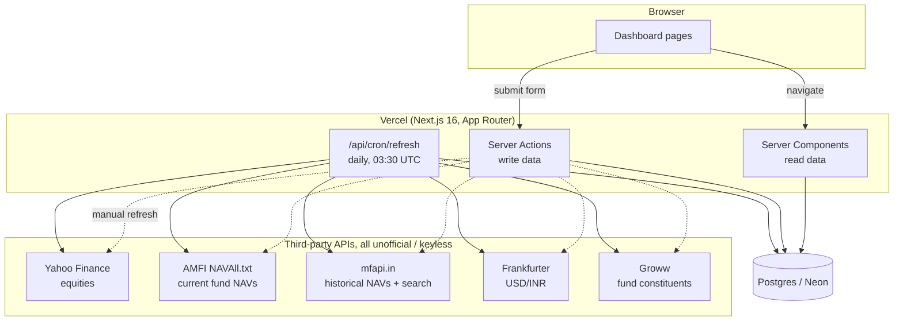
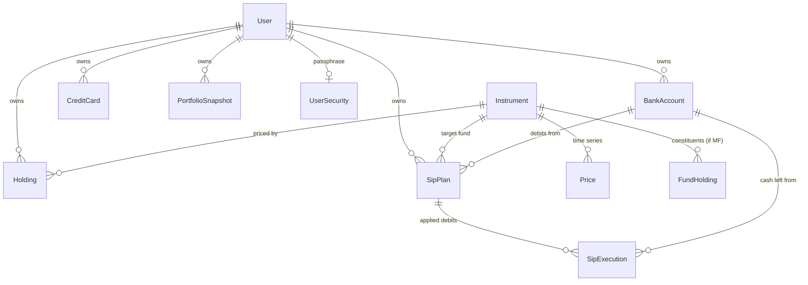

# Corpus: Architecture

_How the system fits together and why it was built this way. `PLAN.md` has the
changelog and reasoning behind each change in the order it happened; this file
has the standing picture. `TODO.md` has what's next._

## What this is

A personal finance hub for **one user**: Indian stocks, mutual funds and US
stocks, bank balances, credit cards, SIPs and a credit score, unified into a
single net-worth view, plus a Tickertape-style mutual-fund overlap/sector
analysis. It holds sensitive data, so "nobody but me" is load-bearing, not a
nice-to-have.

## System shape



One deployable, no separate API server. Server Components read; Server Actions
write; the cron route does the same writes on a schedule. Every third-party
call in the diagram is unofficial and keyless: no vendor contract exists, so
every provider is written to degrade rather than throw (see
[Graceful degradation](#graceful-degradation-everything-outside-the-database-can-fail)).

## Request flow

**Page load.** A route under `src/app/(dashboard)/*` is an `async` Server
Component. It calls `requireUnlocked()`, then queries directly through Prisma
(no client-side fetching, no API route in between) and renders. Nothing is
sent to the browser that the page didn't already have server-side.

**A write.** A form posts to a `"use server"` action in
`lib/<domain>/actions.ts`. The action re-derives the user from the session
(never trusts an id from the client), validates with Zod, writes through
Prisma, and calls `revalidatePath()` on every page that shows the changed
data. There is no separate REST or GraphQL layer: the action *is* the API,
typed end to end.

**Daily refresh.** Vercel Cron hits `/api/cron/refresh` at 03:30 UTC
(`vercel.json`), gated by `CRON_SECRET` as a bearer token. It refreshes
prices, fund constituents, applies due SIP debits, rolls SIP dates forward,
and writes each user's net-worth snapshot for the day, the same sequence the
manual "Refresh" button runs, so there's exactly one code path for it.

## Folder structure

```
src/
  app/
    (dashboard)/<page>/page.tsx   route = feature; layout.tsx gates the group
    api/cron/refresh/route.ts     the one scheduled job
    api/auth/[...nextauth]/       Auth.js handler
  components/
    <domain>/                     dialogs, tables: one component file per concern
    ui/                           shadcn/Base UI primitives, generic
    charts/                       recharts wrappers
  lib/
    <domain>/
      schema.ts        Zod validation + pure helpers (date math, labels)
      queries.ts        read paths, always scoped by userId
      actions.ts        "use server" mutations
      constants.ts       types/labels safe to import from client components
      *.test.ts          co-located with the module they test
    portfolio/providers/         PriceProvider / FxProvider implementations
    db/prisma.ts                 the one PrismaClient singleton
    crypto/encryption.ts         AES-256-GCM field encryption
  generated/prisma/              Prisma client output, gitignored
```

The `schema / queries / actions / constants` split per domain is deliberate
and consistent everywhere (`sips/`, `holdings/`, `accounts/`, `cards/`,
`credit/`, `funds/`...): `constants.ts` has no Prisma import, so it's the only
file in a domain a Client Component may import directly.

## Data model

Every money column is `Prisma.Decimal`, never `Float`: a `Decimal(20,6)` for
per-unit prices and quantities, `Decimal(20,2)` for aggregate rupee amounts.
Floats would silently drift on repeated arithmetic; this is a finance app, so
that's not an acceptable trade.



**`Instrument` is shared across users**, keyed on `(type, symbol)`. One price
fetch serves everyone, which matters once this stops being single-user. A
mutual fund's real identity is its AMFI scheme code (`externalId`), not its
symbol: the seeded funds carry hand-made symbols like `JIOBR_FLEXI` while
search offers `MF153859` for the same scheme, so instrument resolution
matches on scheme code first and falls back to `(type, symbol)`.

**`Holding` stores `quantity` and `avgBuyPrice` directly**, hand-maintained.
It does not record *when* a purchase happened, only `createdAt`, which is
when the row was typed in, not when the money moved. That's the single
biggest gap in the schema today: it blocks XIRR, CSV import, and dividend
tracking. See [`TODO.md`](TODO.md) → the `Transaction` model.

**`SipExecution`** is the audit trail and the idempotency guard for automatic
purchases in one row: unique on `(sipPlanId, dueDate)`, so a cron that runs
twice cannot buy the same units twice. `dueDate` (scheduled) and `navDate`
(NAV actually used) are stored separately because they diverge on a weekend
or public holiday; see
[Debit date vs. allotment date](#debit-date-vs-allotment-date).

**`PortfolioSnapshot`** is one row per user per day, unique on
`(userId, asOf)`, holding both investment totals and full net-worth totals
(assets, liabilities, net). It's what the trend chart reads; without it the
chart would only ever show "now."

## Design decisions

### Graceful degradation: everything outside the database can fail

Every price/NAV/FX/constituent provider follows the same contract
(`PriceProvider` / `FxProvider` in `lib/portfolio/providers/types.ts`):
fetch, and on failure return nothing rather than throwing. `refreshPortfolioPrices()`
counts failures per provider and **never deletes an existing cached price**,
so a dead upstream degrades the freshness of a number instead of blanking it.

This was not theoretical: the AMFI NAV URL returned 404 for months before
anyone noticed, and every mutual fund silently kept its seeded placeholder
price the whole time. The provider threw, degradation swallowed it, and
nothing surfaced the failure. That gap is closed by the next decision.

### Peer comparison over a fixed staleness window

The fix for the above isn't "alert if no price in N days": markets close for
weekends and holidays, so a fixed window either cries wolf every long weekend
or is set so loose that a genuinely dead symbol takes weeks to surface. That
is exactly what happened: five holdings sat on a six-week-old seed price with
no alert.

`findStalePrices()` (`lib/holdings/stale-prices.ts`) instead judges each
instrument **against its own peers of the same type**. If a stock's peers all
priced today and it didn't, the calendar isn't the explanation: the symbol
is wrong (`LAGGING`). If a whole type is behind the clock, peer comparison is
blind to it (everything is equally stale), so the group's freshest price is
separately checked against `now` (`SOURCE_DOWN`), the shape of the AMFI
outage. The slack is 5 days: the longest realistic run of closed market days
is a weekend wrapped around consecutive holidays (4), plus one failed cron
run. Surfaced as the first dashboard nudge, naming the symbols.

### Two search keys, on purpose

Adding a holding used to require knowing the exact ticker and, for a fund,
the AMFI scheme code, and getting either wrong meant the position priced silently as
`null` forever (the five-holding incident above). `lib/instruments/search.ts`
searches by **name** (mfapi.in for funds, Yahoo for equities) purely to
resolve those identifiers; once stored, everything downstream prices by
**symbol or scheme code**, never by name. Search only offers listings the
pricing pipeline can actually quote: Indian equities try `.NS` then `.BO`,
so a BSE-only stock is offered and priced, but a Brazilian DRN or a London
cross-listing is dropped rather than added and left permanently broken.

### Debit date vs. allotment date

A SIP due on a Saturday is allotted at Monday's NAV; the same happens on any
public holiday. Rather than maintain a holiday calendar (goes stale yearly,
still misses exchange-specific closures), `resolveAllotmentNav()`
(`lib/portfolio/providers/mfapi-nav-history.ts`) reads the shift straight off
the published NAV series: **the allotment NAV is the first NAV published on
or after the debit date.** AMFI publishes only on business days, so the
series *is* the business-day calendar, for free. When no NAV exists yet
(due today, before the evening upload) the plan is left alone and retried
rather than priced off a stale figure.

### One blended-average function, two callers

Adding units to an existing position, whether a SIP allotment or a manual
top-up, needs the same weighted-average math:
`(oldInvested + amountSpent) / newQuantity`, computed from the money actually
spent rather than from the rounded unit count (which would leak paise on
every purchase). `blendedAverage()` and `unitsForAmount()` live once in
`lib/sips/math.ts` and are called from both `lib/sips/apply.ts` and
`lib/holdings/actions.ts#topUpHolding`, so the two paths cannot silently
disagree on how a position's cost basis is computed.

### A SIP debit is a transfer, not an event in isolation

When a SIP applies, `applyOneDebit()` updates the holding **and**
decrements the linked bank balance inside the same Prisma transaction. The
same rupees leave the bank and arrive as units, so net worth is unchanged and
only its composition moves: cash and units can never disagree, because
either both writes commit or neither does. The account is optional
(`bankAccountId` on `SipPlan`), and which account paid is recorded per
`SipExecution` rather than read back off the current plan, so re-pointing a
SIP at a different bank later can't rewrite where past debits came from.

### UTC everywhere for calendar dates

Every SIP/card due date is built with `Date.UTC(...)` and rendered with
`timeZone: "UTC"`. This was a real, shipped bug: constructing a date at
*local* midnight under IST stores 18:30 the previous day, which then renders
a day early once read back on a UTC server. Fixed once, as a rule applied
everywhere dates are constructed, not patched per call site.

### Security: two factors, one of them app-specific

Google OAuth (Auth.js, database sessions) gets you a `User` row; it does not
get you into the app. `Session.unlockedAt` is set only after a separate app
passphrase (`scrypt`, verified in `lib/security/passphrase.ts`) is entered at
`/unlock`. `requireUnlocked()` gates the entire `(dashboard)` route group.
The email allowlist (`OWNER_EMAIL`) is checked at sign-in *and* again on
every `requireUser()` call, so revoking the owner email invalidates an
already-signed-in session, not just future sign-ins.

Sensitive fields get one of three treatments, never plaintext storage of the
real thing:

| Data | Treatment |
|---|---|
| Card / bank account number | Last 4 digits only, by default |
| Full bank account number / IFSC | Optional, AES-256-GCM (`lib/crypto/encryption.ts`), never plaintext |
| App passphrase | `scrypt` hash + salt; the passphrase itself is never stored |
| Card PAN / CVV | Never collected, at all |

### No stack migration

The database is ~1,600 rows and ~10 MB. Every real defect this app has had,
from a dead AMFI URL to funds stored as `quantity=1` to SIPs that never
touched holdings to five wrong stock symbols, was a **data quality** problem, not a
technology one, and none would have been prevented by a different database,
ORM, or framework. Next.js gives one deployable with Server Components,
Server Actions and a cron route; Postgres/Neon scales to zero, which matters
for an app one person opens a few times a day. See `TODO.md` for where effort
actually goes instead.

## External integrations

All unofficial, keyless, undocumented rate limits. Each is used read-only and
each is allowed to fail independently.

| Provider | Used for | Matched by |
|---|---|---|
| Yahoo Finance chart API | Current equity prices | Symbol (`.NS` → `.BO` fallback for India, bare for US) |
| Yahoo Finance search API | Equity search-by-name | n/a |
| AMFI `NAVAll.txt` | Current mutual-fund NAVs | AMFI scheme code (`externalId`), name as fallback |
| mfapi.in | Historical NAVs (SIP allotment, top-up-by-amount) + fund search | AMFI scheme code |
| Frankfurter (ECB data) | USD → INR | Currency pair |
| Groww (scraped) | Mutual-fund constituent holdings, for overlap/sector analysis | Pinned per-fund slug |

Outbound fetches from a cold Next.js server process have been measured at
8–9 seconds for the *first* call in a process, versus well under a second
after. Every provider that can be hit cold (NAV history, instrument search)
retries at least once on a generous timeout for exactly this reason. It is
an environment characteristic that has bitten more than once, not a one-off.

## Testing and verification

- `npm test` (vitest), `tsc --noEmit`, `npm run build`: all three green
  before anything is considered done. 99 tests as of this writing, entirely
  unit-level: date/calendar math, Decimal arithmetic, provider parsing,
  schema validation. No end-to-end test suite.
- Authenticated pages can't be screenshotted headlessly (the session cookie
  is `httpOnly`), so verification against the live app seeds a temporary
  pre-unlocked `Session` row, drives the real UI or curls the route with that
  cookie, then deletes the row and restores any data it touched.
- Money-affecting changes (SIP application, top-ups) are verified against
  live third-party data end to end (real NAVs, real bank debits) on
  throwaway holdings, then rolled back, with every resulting figure checked
  against an independent hand calculation before being trusted.

## Known gotchas

- **Turbopack caches CSS aggressively.** After editing `globals.css` tokens,
  a stale `.next` keeps serving the old palette and silently drops new
  rules. `rm -rf .next` and restart before debugging the CSS itself.
- **Base UI + RSC:** don't pass a JSX trigger element from a Server Component
  into a Client Component and `cloneElement` it ("Element type is invalid").
  Client components build their own triggers. Base UI `Button` uses
  `render`, not `asChild`; pass `nativeButton={false}` for a link.
- **Prisma schema changes need a dev-server restart**: the client singleton
  caches in memory.
- **Groww is unofficial and scraped**, so it can break if their page
  changes. The refresh keeps last-known-good constituents on failure.
- **A published NAV series doubles as a business-day calendar.** AMFI
  publishes only on settlement days, so a missing date means a weekend or a
  holiday. See [Debit date vs. allotment date](#debit-date-vs-allotment-date).
- **Native `<select>` needs `color-scheme: dark` stated explicitly.** A
  dark-only app that never declares it gets the OS *light* theme for every
  browser-rendered popup (dropdown options, date pickers, scrollbars); no
  amount of styling the closed `<select>` reaches that surface.
- **recharts defaults a numeric y-axis to `[0, 'auto']`.** For values that
  never approach zero (a net-worth figure), that pins the entire data band
  into a sliver at the top of the plot. Pass an explicit `domain` fitted to
  the data on screen (`lib/networth/trend-range.ts#niceDomain`).
- **A clock read during render is impure** and risks a server/browser
  hydration mismatch (the React Compiler's `react-hooks/purity` lint catches
  it). Windowed views (the trend chart's range picker) measure from the
  newest *data point*, not from `Date.now()`.
- **Moving the production domain breaks Google sign-in until Google is told.**
  `trustHost: true` in `src/auth.ts` means Auth.js computes the OAuth
  callback URL from whatever host the request actually arrives on, so no
  code or env var needs to change when the domain does. Google still
  validates that exact callback URL against a fixed allow-list on the OAuth
  client, though, so a domain change needs one manual step in
  [Google Cloud Console](https://console.cloud.google.com/apis/credentials):
  add `https://<new-domain>/api/auth/callback/google` under Authorized
  redirect URIs and `https://<new-domain>` under Authorized JavaScript
  origins, or every sign-in fails with `Error 400: redirect_uri_mismatch`.
  Also: renaming a Vercel project's **name** does not free up or claim a
  matching `.vercel.app` subdomain if that subdomain is already taken by an
  unrelated Vercel user elsewhere; the domain has to be added separately
  under Settings → Domains and marked Production.

## Deployment

Vercel (private), Neon Postgres. `vercel.json` defines the one cron job.
Required env vars: `DATABASE_URL`, `AUTH_SECRET`, `AUTH_GOOGLE_ID` /
`AUTH_GOOGLE_SECRET`, `OWNER_EMAIL`, `ENCRYPTION_KEY` (32-byte base64),
`PRICE_STALE_HOURS`, `CRON_SECRET`.

```bash
npm run dev          # local dev server
npm test              # vitest, run once
npx tsc --noEmit       # type-check
npm run build          # prisma generate + next build
npx prisma db push     # push schema changes (dev / no-migration-history flow)
```

## See also

- [`PLAN.md`](PLAN.md): what's been built, in the order it happened, with
  the reasoning and the bugs behind each change.
- [`TODO.md`](TODO.md): what's next, ordered by what unblocks the most.
